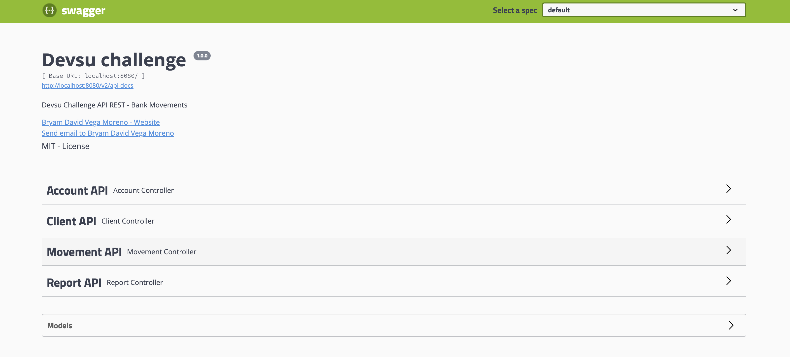
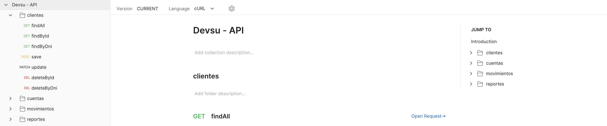

<h1 style="text-align: center;">Bank Movements</h1>

<p align="center">
  
  
</p>

> Developed by: Bryam Vega
----

This project is a technical test of the company Devsu, related to banking movements and the deployment of an API to perform such actions.

In this project we use several programming paradigms, which are:

* Functional Programming
* Aspect Oriented Programming
* Object Oriented Programming

Similarly, the following software design patterns were used:

* Repository Pattern
* Builder Pattern
* Adapter Pattern

## How to build

### Main process : `devsu-challenge` (requires java 16+)

```shell
$ cd devsu-challenge
$ gradle build -x test
$ docker build -t devsu .
```

## Run All project: `docker-compose`

```shell
$ cd docker
$ docker-compose up
```

## How to use

### Swagger

Enter the devsu-challenge project swagger through the link swagger and you will get the following result:



### Postman

You can use all endpoints on this swagger or you can use postman. To use postman you must import `.json`
file called `Devsu-API.json`

